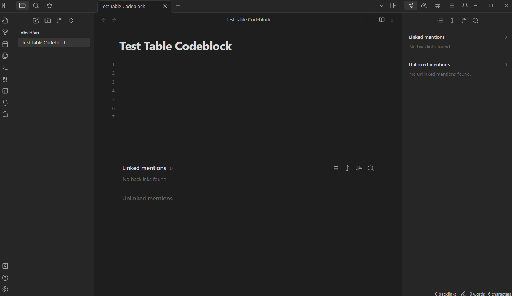

# Table Code Block for Obsidian  

Table Code Block in Obsidian:  

- Add Row  
- Add Column  
- Edit Cell  
- Remove Row  
- Remove Column
- Set Head Row  
- Insert To Left Top Right Bottom  
- Quick Create Table  
- Multi Lines  
- Render  
  - Headings  
  - Links  
  - Image  
  - Checkbox  
  - HTML  
  - Bold  
  - Italic  
  - Bold and Italic  
  - Block Quotes  
  - Lists  
  - Horizontal Rules  
- Translation  

## Not Support  

- Inline Embed  

## Demo

  
